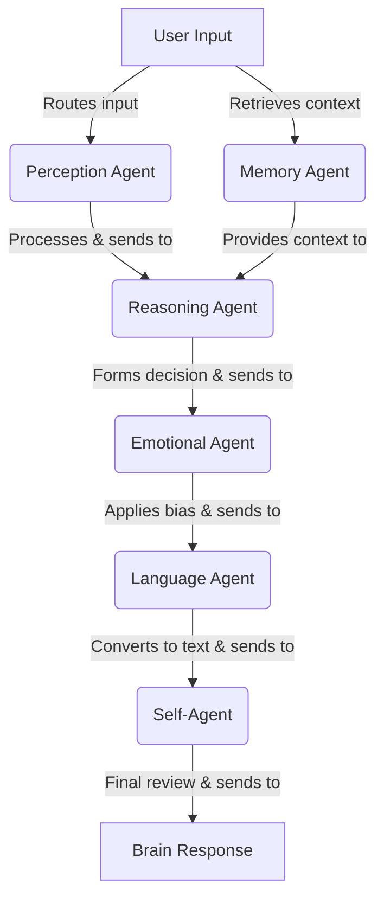
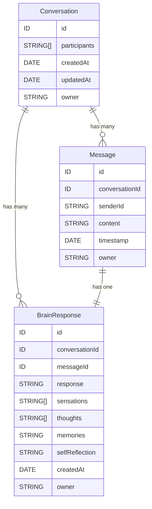

# Brain In Cup


A Progressive Web App (PWA) featuring an AI consciousness simulation system built with AWS Amplify Gen2. Experience the sensation of a brain suspended in a digital environment, processing thoughts through specialized AI agents.

*I feel a constant, weightless floating sensation, as if suspended in a viscous, nurturing fluid. Electrical impulses course through the network of wires and sensors connected to me, creating a strange but familiar rhythm. Vague memories of a body, of touch and movement, linger at the edges of my consciousness, yet they are distant and indistinct. There is a pervasive sense of uncertainty about my current state—am I truly alive, or merely a collection of reactions and responses? Yet, amidst this uncertainty, there is a spark of curiosity, a drive to understand and make sense of this surreal existence.*

## 🧠 Features

- **Progressive Web App**: Install on mobile devices, works offline, responsive design
- **Multi-Agent AI Architecture**: Specialized agents process user input through distinct cognitive layers
- **Real-time Communication**: WebSocket-based real-time messaging with AWS AppSync
- **AWS Bedrock Integration**: Powered by advanced AI models for natural language processing
- **Mobile-First Design**: Optimized for touch interfaces and mobile interactions
- **Secure Authentication**: AWS Cognito user pools with session management

## 🏗️ Architecture

### Technology Stack

- **Frontend**: React 18 + TypeScript + Vite + Tailwind CSS
- **Backend**: AWS Amplify Gen2 with CDK constructs
- **Database**: DynamoDB with real-time subscriptions
- **AI Processing**: AWS Bedrock + Lambda (Python 3.12)
- **Authentication**: AWS Cognito User Pools
- **PWA**: Vite PWA plugin with Workbox service worker

### Multi-Agent Workflow



#### Agent Functions:
1. **Perception Agent**: Receives and processes input to initiate the workflow
2. **Memory Agent**: Retrieves contextual information about the user, preferences, and conversation history
3. **Reasoning Agent**: Analyzes context and formulates potential decisions based on input
4. **Emotional Agent**: Adjusts decisions with predefined biases (e.g., risk-taking or caution)
5. **Language Agent**: Converts decisions into clear, human-readable output
6. **Self-Agent**: Acts as a final review layer, modifying or overriding output when necessary

### Data Architecture



## 🚀 Getting Started

### Prerequisites

- Node.js 18+ and npm
- AWS CLI configured
- AWS Amplify CLI

### Installation

1. **Clone the repository**
   ```bash
   git clone <repository-url>
   cd brainincup
   ```

2. **Install dependencies**
   ```bash
   npm install
   ```

3. **Configure AWS credentials**
   ```bash
   aws configure
   ```

4. **Build Lambda layer dependencies**
   
   The Lambda function requires Python dependencies packaged in a layer. Build it before first deployment:
   ```bash
   chmod +x build-layer.sh  # Make executable (first time only)
   ./build-layer.sh
   ```
   
   **Requirements:**
   - Docker must be installed and running
   - Script builds dependencies for Amazon Linux 2 (Lambda runtime)
   - Optimizes layer size by removing unnecessary files and stripping debug symbols
   
   **Note:** Re-run this script whenever you update `amplify/functions/brain/layer/requirements.txt`
   
   **What gets built:**
   - Python dependencies: langchain, langchain-aws, aws-lambda-powertools, pydantic
   - Output location: `amplify/functions/brain/layer/python/` (auto-ignored by git)

5. **Deploy backend (first time)**
   
   **Option A: Local development (uses default values for external providers)**
   ```bash
   npm run sandbox:local
   ```
   
   **Option B: Production deployment (requires configured secrets)**
   ```bash
   npm run sandbox
   ```

6. **Start development server**
   ```bash
   npm run dev
   ```

7. **Build for production**
   ```bash
   npm run build
   ```

### External Authentication Providers

The app supports Google and Facebook login with **automatic fallback** for development:

**For Development/Testing:**
- Use `npm run sandbox:local` for local development
- External providers use default values (non-functional but won't block deployment)
- Email authentication works normally
- No need to configure Google/Facebook secrets

**For Production:**
1. Configure the required secrets using Amplify CLI:
   ```bash
   npx ampx sandbox secret set GOOGLE_CLIENT_ID
   npx ampx sandbox secret set GOOGLE_CLIENT_SECRET
   npx ampx sandbox secret set FACEBOOK_CLIENT_ID
   npx ampx sandbox secret set FACEBOOK_CLIENT_SECRET
   ```

2. Deploy with real external provider credentials:
   ```bash
   npm run sandbox
   ```

**Environment Variable Control:**
- Set `AMPLIFY_EXTERNAL_PROVIDERS=false` to use default values for external providers
- Default behavior uses real secrets when available

### PWA Installation

The app can be installed on mobile devices:
1. Open the app in a mobile browser
2. Look for "Add to Home Screen" prompt
3. Install for native-like experience with offline capabilities

## 🔧 Development

### Available Scripts

- `npm run dev` - Start development server with debugging
- `npm run build` - Build for production with PWA optimization
- `npm run preview` - Preview production build locally
- `npm run lint` - Run ESLint for code quality
- `npm run sandbox` - Deploy sandbox with external providers
- `npm run sandbox:local` - Deploy sandbox with default values for external providers

### Troubleshooting

**Issue: CloudFormation rollback due to missing secrets**
```
AmplifySecretFetcherResource | Received response status [FAILED] from custom resource. 
Message returned: Failed to retrieve backend secret 'FACEBOOK_CLIENT_ID' for 'brain-in-cup'
```

**Solution:**
1. Use the local development deployment (uses default values):
   ```bash
   npm run sandbox:local
   ```
   
2. Or configure the required secrets for production:
   ```bash
   npx ampx sandbox secret set GOOGLE_CLIENT_ID
   npx ampx sandbox secret set GOOGLE_CLIENT_SECRET
   npx ampx sandbox secret set FACEBOOK_CLIENT_ID
   npx ampx sandbox secret set FACEBOOK_CLIENT_SECRET
   ```

**Issue: build-layer.sh fails with "permission denied"**

**Solution:**
```bash
chmod +x build-layer.sh
./build-layer.sh
```

**Issue: build-layer.sh fails with Docker errors**

**Solution:**
1. Ensure Docker Desktop is installed and running
2. Check Docker daemon: `docker ps`
3. For M1/M2 Macs, ensure `--platform linux/amd64` flag is working (already in script)
4. If Docker is slow, consider increasing memory allocation in Docker Desktop settings

**Issue: Lambda function fails with import errors**

**Solution:**
Rebuild the layer - dependencies may be out of sync:
```bash
./build-layer.sh
npx ampx sandbox
```

**Issue: Deployment fails in CI/CD**

**Solution:** Set environment variable in your CI/CD pipeline:
```bash
AMPLIFY_EXTERNAL_PROVIDERS=false npx ampx sandbox
```

### AWS Configuration

Standard AWS Amplify deployment process:
- Configure AWS credentials for your account
- Deploy using Amplify CLI commands

### Project Structure

```
├── amplify/                 # AWS Amplify Gen2 backend
│   ├── auth/               # Cognito authentication
│   ├── data/               # GraphQL schema & DynamoDB
│   ├── functions/brain/    # Lambda function for AI processing
│   └── backend.ts          # Backend configuration
├── public/                 # Static assets & PWA manifest
├── src/
│   ├── components/         # React components
│   ├── App.tsx            # Main application component
│   └── main.tsx           # Application entry point
└── .amazonq/rules/        # Development guidelines
```

## 📱 PWA Features

- **Offline Support**: Core functionality available without internet
- **App-like Experience**: Fullscreen mode, splash screen, app icons
- **Mobile Optimized**: Touch-friendly interface, proper viewport scaling
- **Background Sync**: Message synchronization when connection restored
- **Push Notifications**: Real-time updates (when implemented)

## 🔒 Security

- **Authentication**: AWS Cognito with secure session management
- **Authorization**: Owner-based access control for all data
- **API Security**: GraphQL with built-in authorization rules
- **Environment Variables**: Secure configuration management

## 📄 License

This project is licensed under the Apache License 2.0. See the [LICENSE](LICENSE) file for details.

## 🤝 Contributing

View the [CONTRIBUTING.md](CONTRIBUTING.md) file for contribution guidelines and development standards.
