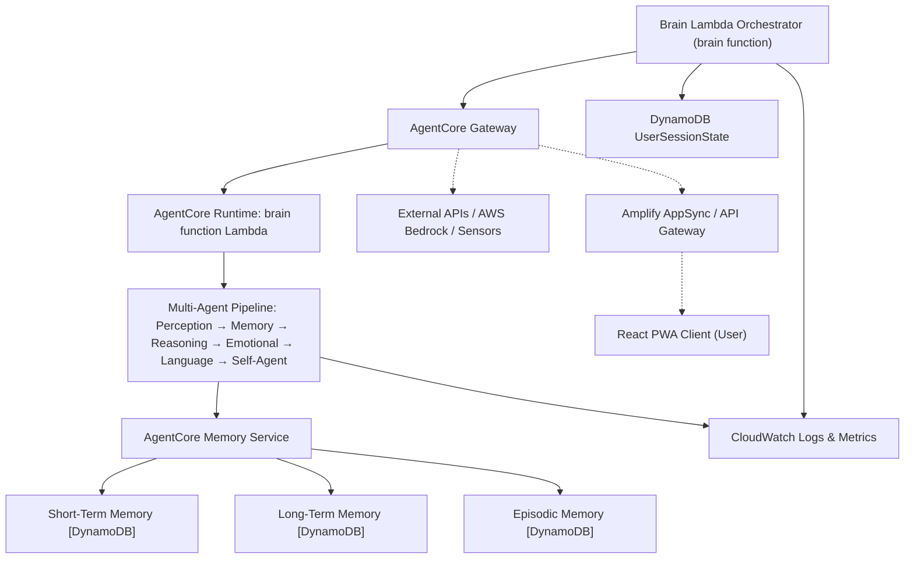
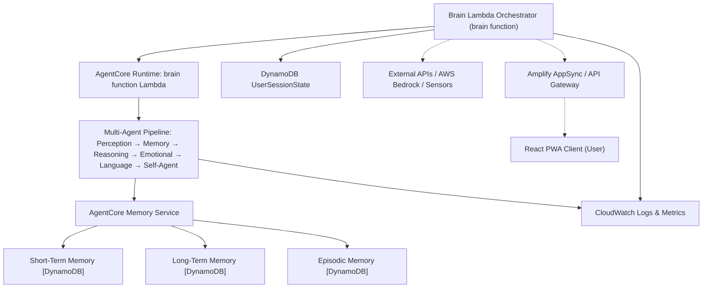

# AgentCore Architecture Overview

This document provides a clear, project-specific overview of how AgentCore is integrated into the Brain In Cup system. It compares two architectural approaches—**with** and **without** an AgentCore Gateway—and explains the role and use cases for each memory type in the agent pipeline.

---

## Architecture With AgentCore Gateway

The AgentCore Gateway acts as an intermediary between the Brain Lambda Orchestrator and the AgentCore Runtime. This pattern is useful for future extensibility, centralized routing, and integration with external systems.

**Use Case:**  
- Centralizes routing and integration for future expansion (e.g., multiple runtimes, external APIs, sensors).
- Provides a dedicated layer for protocol translation, security, and observability.
- Recommended for complex, multi-client, or multi-runtime scenarios.

---

## Architecture Without AgentCore Gateway

In the current Brain In Cup setup, the AgentCore Gateway is not required. The Brain Lambda Orchestrator communicates directly with the AgentCore Runtime, keeping the architecture simple and efficient.

**Use Case:**  
- Direct orchestration of agent pipeline, memory, session state, and integrations.
- AWS services (AppSync, API Gateway, Cognito) handle routing, authentication, and observability.
- Ideal for single-runtime, single-client scenarios where simplicity and efficiency are priorities.

---

## Memory Types in Brain In Cup: Project-Specific Use Cases

**Short-Term Memory (STM):**
- Stores recent user inputs, agent responses, and transient context for the current session.
- Enables immediate recall and context continuity within a conversation.
- Example: The last few messages exchanged in a chat, temporary facts, or session-specific variables.

**Long-Term Memory (LTM):**
- Persists important facts, learned information, and durable context across sessions.
- Supports knowledge retention, personalization, and reference to past interactions.
- Example: User preferences, recurring topics, or facts the agent has learned about the user.

**Episodic Memory (EPM):**
- Captures significant events, experiences, or milestones in the agent’s interaction history.
- Used for recalling meaningful moments, summarizing experiences, and supporting narrative continuity.
- Example: Notable conversation highlights, emotional peaks, or completed tasks/goals.

---

## Summary & Recommendation

- **With AgentCore Gateway:**  
  - Adds flexibility for future integrations and complex routing.
  - Useful for scaling, multi-client, or multi-runtime architectures.

- **Without AgentCore Gateway:**  
  - Keeps architecture simple and efficient.
  - Matches current project requirements with a single orchestrator and runtime.

**Recommendation:**  
Adopt the simpler architecture (without AgentCore Gateway) for now. Revisit the gateway pattern if future requirements demand more extensibility, integration complexity, or multi-runtime support.

---