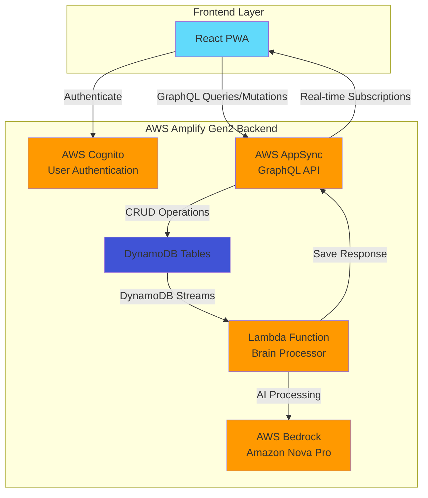
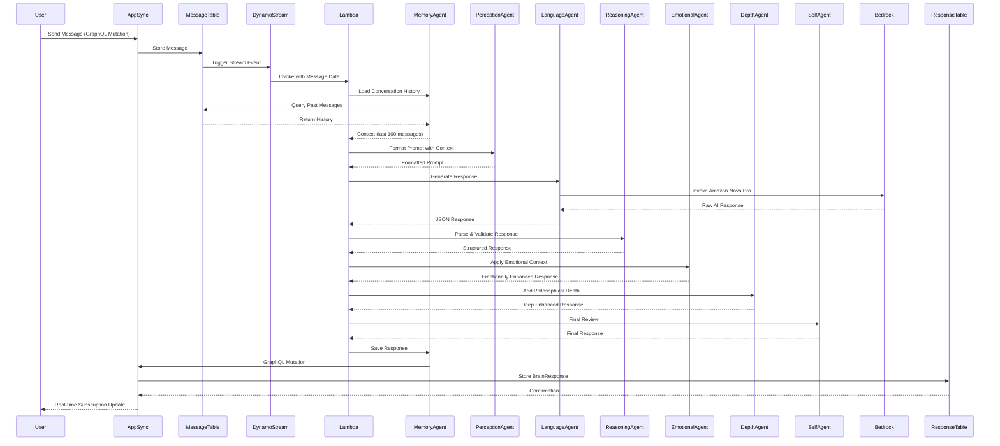

# Brain In Cup - Backend Architecture

## Overview
This document describes the complete backend architecture of the Brain In Cup AI consciousness simulation system, built with AWS Amplify Gen2.

## High-Level Architecture

## Authentication Flow

## Data Model

## Message Processing Flow

## Multi-Agent Processing Pipeline

## Agent Responsibilities

## Lambda Function Architecture

## Lambda Dependencies & Permissions

## DynamoDB Streams Integration

## AI Processing Details

## Response Structure

## Depth Agent Enhancement Process

## Memory Agent Operations

## Backend Configuration Flow

## Security & Authorization

## Complete Request-Response Cycle

## Key Technologies Summary

| Component | Technology | Purpose |
|-----------|-----------|---------|
| **Backend Framework** | AWS Amplify Gen2 | Infrastructure as Code |
| **Authentication** | AWS Cognito | User management & OAuth |
| **API Layer** | AWS AppSync | GraphQL API with real-time |
| **Database** | DynamoDB | NoSQL data storage |
| **Compute** | AWS Lambda (Python 3.12) | Serverless AI processing |
| **AI Model** | Amazon Nova Pro v1.0 | Natural language generation |
| **AI Framework** | LangChain | LLM orchestration |
| **Infrastructure** | AWS CDK | Custom resource configuration |
| **Authorization** | Cognito User Pools | JWT-based auth |

## Deployment Architecture

## Scalability & Performance Features

- **Real-time Updates**: GraphQL subscriptions provide instant UI updates
- **Event-Driven**: DynamoDB Streams trigger Lambda asynchronously
- **Serverless**: Auto-scaling Lambda functions handle variable load
- **Stream Processing**: Batch processing of multiple messages
- **Context Caching**: Conversation history loaded once per invocation
- **Owner Isolation**: Data access limited by Cognito user identity
- **Lambda Layers**: Shared dependencies reduce cold start time

## Future Enhancements

1. **Emotional Agent**: Implement full emotional state tracking and modulation
2. **Self Agent**: Add sophisticated self-review and quality control logic
3. **Memory System**: Implement long-term memory storage and retrieval
4. **Multi-Model**: Support for multiple AI models beyond Nova Pro
5. **Caching**: Add conversation context caching for faster responses
6. **Analytics**: Track conversation patterns and user engagement
7. **A/B Testing**: Test different agent configurations and prompts

---

*Generated for Brain In Cup - AI Consciousness Simulation System*
