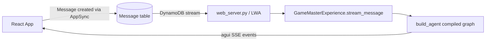
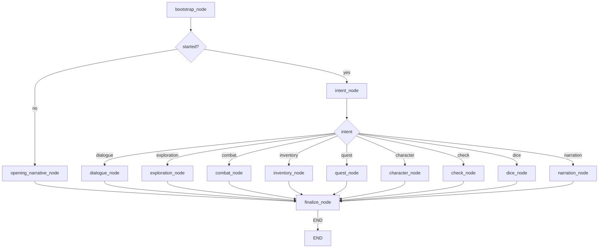
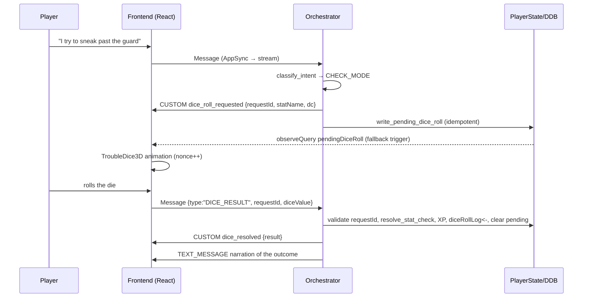

# Game Master Orchestration, Pacing & Event Systems

## Overview

The **Game Master** experience is a LangGraph-driven orchestrator. Every player
message is routed through a deterministic decision tree that decides *what
happens* (rules, dice, quests, location, pacing), and the LLM is used **only to
narrate** the already-decided outcome. This keeps the game consistent,
testable, and immune to the LLM "making up" stats, gold, or locations.

The orchestrator couples three layers:

1. **Orchestration** — a LangGraph `StateGraph` that routes one turn.
2. **Pacing** — a pure act/chapter/tension engine that gives the story a
   managed, cinematically reasonable rhythm with milestones.
3. **Events** — the AG-UI event protocol (SSE stream) plus two out-of-band
   channels: AgentCore **episodic memory** and the DynamoDB **PlayerState**
   row (drives the dice UI).

Code lives under
`amplify/functions/brain/src/experiences/game_master/orchestrator/`.

---

## 1. Orchestration

### Entry point



The frontend writes a `Message` through AppSync, the DynamoDB stream invokes the
Lambda (`web_server.py`, served via Lambda Web Adapter), which calls
`GameMasterExperience.stream_message(ctx)`. That method seeds the graph with
`classify_and_prepare(...)` and streams AG-UI events with
`agent.stream(state, stream_mode="custom")`.

> The legacy free-text GM data plane (`app/`, `Controller`, `mode_handlers`,
> `narrative_extractor`) has been removed. Live GM traffic is exclusively this
> orchestrator path.

### The turn pipeline



#### `bootstrap_node` — load authoritative state

- Loads the `GameMasterCharacter` row (`store.load_player`) and the
  `GameMasterAdventure` row (`store.load_campaign`); creates the adventure row
  on first run (`ensure_campaign`).
- Pulls relevant **episodic memory** (see §3) into `memory_context`.
- Emits a `STATE_SNAPSHOT` with character + location (and, at finalize, pacing).

#### Game-mode nodes — deterministic systems, LLM narrates

Each mode node:

1. Runs its deterministic rules (e.g. `systems.player_attack`, the quest step
   table, `content.resolve_location_transition`).
2. Builds `facts` — plain strings describing only what the engine decided.
3. Calls `generate_narration` with `[GAME_FACTS]` so the LLM vividly *describes*
   but never *overrides* the state.
4. Persists only where a rule changed persisted state.

The `intent` router (`intent.py`) is a **keyword classifier**, never an LLM.
It maps to: `dialogue`, `exploration`, `combat`, `inventory`, `quest`,
`character`, `check`, `dice`, `narration`.

#### `finalize_node` — pacing, snapshot, memory

Runs on every turn. It:

- Computes the pacing delta via `apply_pacing(campaign, game_mode, landmark)`
  (see §2) and persists it onto the adventure row.
- Emits a final `STATE_SNAPSHOT` (character + location + pacing).
- Records the turn into AgentCore episodic memory (`_record_memory_turn`).
- Emits the `response_complete` CUSTOM event with the final text + metadata
  (including the pacing snapshot).

### Orchestrator state

`OrchestratorState` (TypedDict) carries identity (`conversation_id`, `owner`),
wiring (`system_prompt`, `model_id`, `region`, `store`, `memory`), authoritative
session objects (`player`, `campaign`), routing (`intent`, `game_mode`,
`target_npc_id`), `facts`, and output (`opened`, `final_message`,
`response_metadata`).

### Persistence

`OrchestrationStore` (`persistence.py`) wraps four DynamoDB tables:

| Table              | Holds                                                            |
| ------------------ | ---------------------------------------------------------------- |
| `GameMasterCharacter` | Player stats, level, XP, HP, inventory, gold                  |
| `GameMasterAdventure` | Campaign narrative: location, scene, objectives, pacing cols, timeline |
| `ActiveQuest`        | Quest status registry                                          |
| `PlayerState`        | UI-facing state incl. `pendingDiceRoll`, `diceRollLog`, version |

Index names are discovered at runtime (`_conversation_index`, `_campaign_index`)
rather than hard-coded.

---

## 2. Pacing

### Purpose

Pacing gives the campaign **a managed, reasonable drift** — the player is not
stuck in one act forever, nor thrown from eruption to eruption. It mirrors the
classic five-act structure and keeps a 1–10 tension dial that decides *when*
the story advances.

Unlike the legacy `NarrativeExtractor` (which regex-scanned LLM prose), the
orchestrator's pacing in `pacing.py` is derived from **deterministic signals
only**: the resolved game mode and engine-observed story landmarks. The LLM can
never "decide" to advance the act or bump tension — the engine does, from
observable events.

### State

```json
{
  "currentAct": "EXPOSITION",
  "currentChapter": 1,
  "tensionLevel": 3,
  "turnsInChapter": 0,
  "turnsSinceBeat": 0,
  "timeline": []
}
```

### How a turn moves the dial

`apply_pacing(campaign, game_mode, landmark)`:

1. **Tension delta** from the resolved mode:

   | Mode       | Δ tension |
   | ---------- | --------- |
   | combat     | +1        |
   | dialogue   | −1        |
   | inventory  | −1        |
   | character  | −1        |
   | others     | 0         |

   A **landmark** adds a further +1 (a resolved milestone has momentum).
   Tension clamps to 1–10.

2. **Beat counter**: conflict/exploration/check/dice/quest turns (or any
   landmark) reset `turnsSinceBeat` — the story is moving. Roleplay turns let
   it creep up.

3. **Chapter break** when the beat counter ≥ 6 or the chapter is long
   (`turnsInChapter` ≥ 12), then `turnsInChapter` resets.

4. **Act progression**:

   | From              | → To            | Trigger                |
   | ----------------- | -------------- | ---------------------- |
   | EXPOSITION        | RISING_ACTION  | 4+ turns in chapter **or** tension ≥ 5 |
   | RISING_ACTION     | CLIMAX         | tension ≥ 8            |
   | CLIMAX            | FALLING_ACTION | tension ≤ 5            |
   | FALLING_ACTION    | RESOLUTION     | 6+ turns **or** tension ≤ 3 |

5. **Timeline landmarks** kept to the last 20 entries.

### Milestones / landmarks

A `landmark` is an engine-observed story milestone, produced by
`_story_landmark` in `nodes.py`, never by prose:

- `quest-completed`
- `quest-progress-<step>` (e.g. `clear_cellar`, `recover_lantern`,
  `return_lantern`)
- `dice-resolved` (a stat-check turn resolved)
- `hazard-<location>` (an enemy-bearing location visited)

The pacing snapshot exposed to the UI:

```json
{
  "act": "RISING_ACTION",
  "chapter": 2,
  "tension": 6,
  "landmarks": ["quest-progress-clear_cellar"]
}
```

---

## 3. Episodic memory (AgentCore)

### Design

The orchestrator delegates memory to **Amazon Bedrock AgentCore** using the
**episodic memory strategy** — it does not hand-roll its own store. AgentCore
detects completed episodes, consolidates them, and later generates
**reflections** (insights across episodes).

`orchestrator/memory.py` defines a small `MemoryService`:

- **Namespaces** — episodes/reflections live at
  `/strategy/{episodicStrategyId}/actor/{actorId}/`.
- **Recording** — `record_turn` posts a `USER` and `ASSISTANT`
  `create_event` per turn, feeding AgentCore's extraction. Metadata carries
  `conversationId`, `intent`, `personalityMode`.
- **Retrieval** — `retrieve_episodic_context` runs a semantic
  `retrieve_memory_records` against the episodes namespace (matching strategy
  id) and formats a `=== EPISODIC MEMORY ===` block for the narration prompt.
- **Long-term records** — `save_long_term_record` persists structured records
  (later used for character/world snapshots).

### Wiring

- `classify_and_prepare` builds the service from env:
  `AGENTCORE_MEMORY_ID`, `AGENTCORE_MEMORY_EPISODIC_STRATEGY_ID` (+ region).
- `bootstrap_node` retrieves context into `memory_context`.
- `_facts_prompt` prepends the block to every narration prompt.
- `finalize_node` records the completed turn.

### Safety

The service is a **safe no-op** whenever AgentCore is unconfigured, and every
call is wrapped so a memory failure is logged and swallowed — memory can never
break gameplay.

---

## 4. Event systems

### 4.1 AG-UI SSE stream (back → front)

The Lambda returns AG-UI events as Server-Sent Events over the Function URL
stream (see `experiences/agui/events.py`). The orchestrator emits:

| Event                           | When                                             |
| ------------------------------- | ------------------------------------------------ |
| `RUN_STARTED`                   | `ExperienceResponse.stream_message` begins       |
| `TEXT_MESSAGE_START/CONTENT/END`| each narration token stream                      |
| `STATE_SNAPSHOT`                | bootstrap (player/location) and finalize (+pacing) |
| `CUSTOM` (`response_complete`)  | finalize; carries the full text + metadata       |
| `RUN_FINISHED` / `RUN_ERROR`    | terminal outcomes                                 |

`llm.generate_narration` streams tokens as `TEXT_MESSAGE_*` events; nodes emit
snapshots/custom events via `get_stream_writer()`.

### 4.2 Dice event contract

The dice flow is what makes "roll the die to resolve" work end-to-end:



Two **redundant triggers** start the roll UI:

1. **Inline**: the `dice_roll_requested` CUSTOM event during the SSE stream
   (`App.tsx` `case 'CUSTOM'`).
2. **Subscribed**: `write_pending_dice_roll` persists `pendingDiceRoll` to
   `PlayerState`; the frontend's `observeQuery` watcher activates the dice
   animation as a fallback (e.g. when streaming is bypassed).

The die result arrives as a normal `Message` whose content is the JSON
`{"type":"DICE_RESULT","requestId":...,"diceValue":...}`. `intent.py` parses it
(`parse_dice_result`, incl. the legacy `[DICE_RESULT]` wrapper) and routes it to
`dice_node`, which validates the requestId against the pending roll, resolves
the check (`systems.resolve_stat_check`), awards XP on success, logs to
`diceRollLog`, clears the pending roll, and narrates the outcome.

`systems.request_stat_check` produces the pending-roll payload:

```json
{
  "requestId": "uuid",
  "statName": "dexterity",
  "statValue": 16,
  "difficultyClass": 15,
  "description": "...",
  "baseXPReward": 10,
  "expiresAt": "ISO-8601 +5min"
}
```

### 4.3 Other channels

- **PlayerState subscription** — drives the dice animation, `diceRollLog`, and
  level/XP display live via AppSync `observeQuery`.
- **GameMasterAdventure subscription** — keeps `currentLocation` (and the paced
  columns) live in the sidebar/banner.

---

## 5. Flow summary per turn

1. **Identity** — stream starts; `run_started` emitted.
2. **Bootstrap** — player + campaign loaded, episodic memory fetched, initial
   `STATE_SNAPSHOT`.
3. **Route** — first turn → opening narrative; otherwise `intent_node` chooses
   exactly one mode.
4. **Resolve + narrate** — the mode runs deterministic rules, then streams a
   narration. For `check` it also emits the dice request; for `dice` it resolves
   the submitted roll.
5. **Finalize** — pacing advances + persists, final snapshot, episodic memory
   recorded, `response_complete` custom event.
6. **Terminate** — `run_finished`.

Every rule lives in pure, testable code (`content`, `systems`, `pacing`); the
LLM only paints the scene.